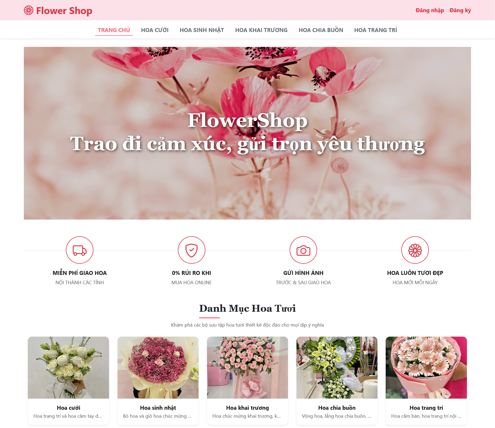
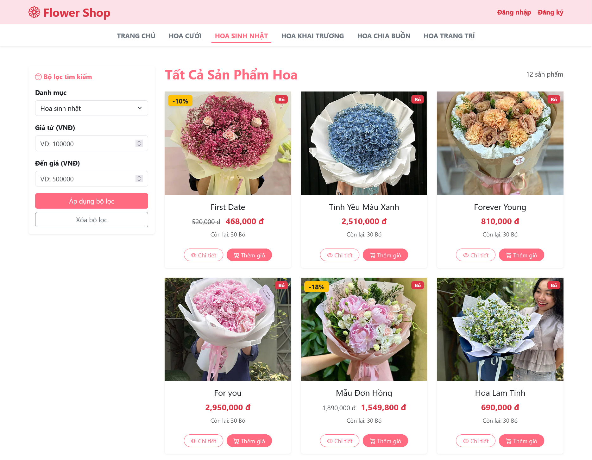
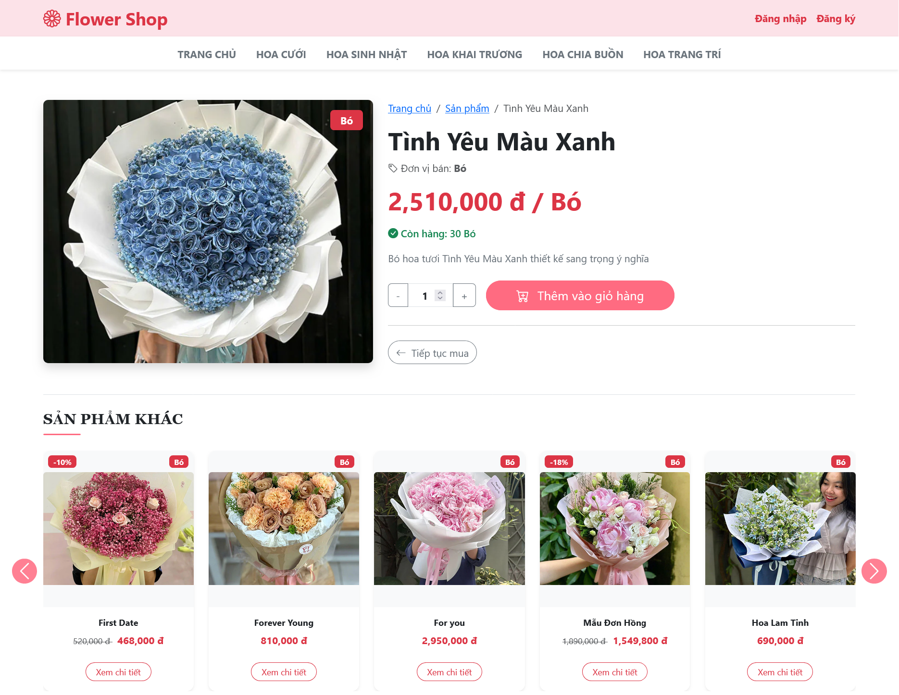
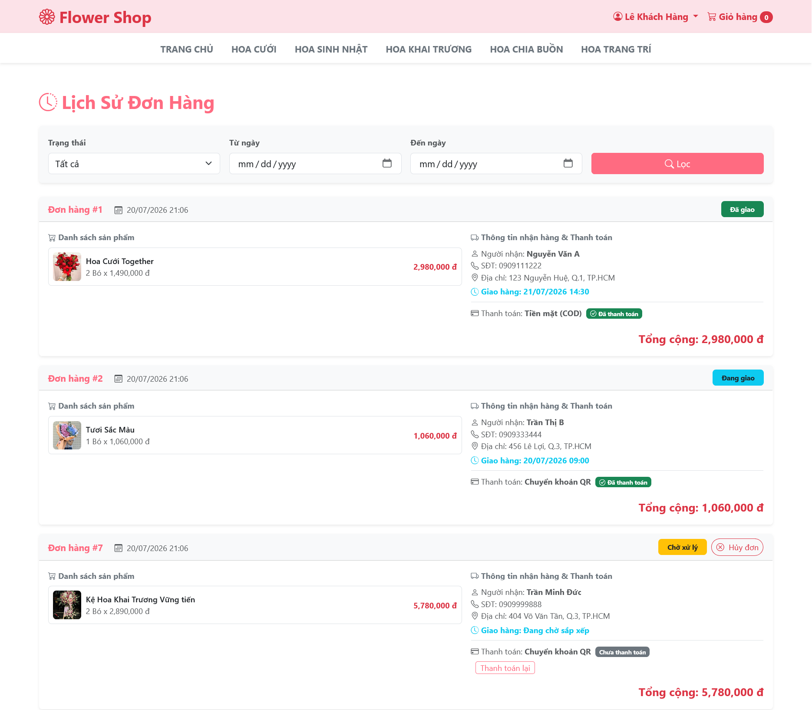
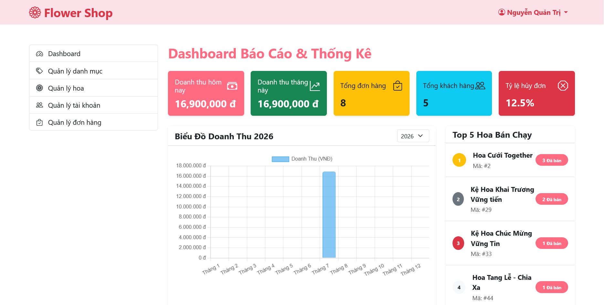
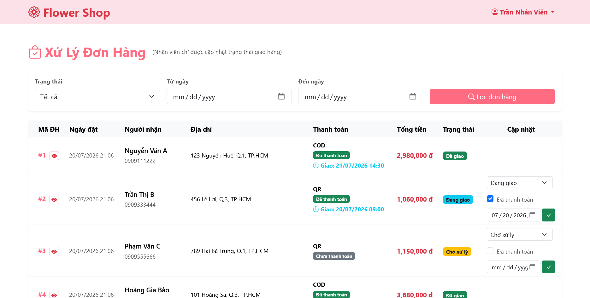

# Flower shop 


Đây là dự án về cửa hàng hoa thuộc học phần PRJ302, Kỳ Summer 2026. 
## Tính năng chính

- **Xác thực & Phân quyền**: Đăng ký, đăng nhập bảo mật với mật khẩu mã hóa SHA-256, cùng cơ chế phân quyền 3 vai trò (Admin, Employee, Customer) qua Servlet Filter.
- **Khách hàng & Khách vãng lai**:
  - Tìm kiếm, lọc sản phẩm theo danh mục và giá; xem chi tiết hoa kèm thanh trượt gợi ý.
  - Quản lý giỏ hàng tương tác (AJAX), đặt hàng chọn ngày giờ giao và hỗ trợ thanh toán COD, VietQR hoặc MoMo.
  - Theo dõi lịch sử đơn hàng và quản lý hồ sơ cá nhân.
- **Nhân viên cửa hàng**: Tiếp nhận và cập nhật trạng thái đơn hàng, hỗ trợ hủy đơn kèm tự động hoàn tồn kho.
- **Quản trị viên**: Xem dashboard thống kê tổng quan (doanh thu, sản phẩm, tài khoản) và quản trị toàn bộ dữ liệu hệ thống (CRUD).
- **Công cụ tự động hóa**: Script Python (`compare_and_insert.py`) thu thập dữ liệu hoa tự động từ trang nguồn.

## Công nghệ 
#### Front-End
- HTML5
- CSS
- Bootstrap

#### Back-End
- Tomcat 10
- JST, JSTL + EL
- JDBC

#### Hệ thống quản lý Database
- MS SQL
## Hướng dẫn Chạy Liveserver

### Bằng Docker Compose
Khởi chạy hệ thống bằng câu lệnh sau:
```bash
docker compose up -d --build
```
Sau khi quá trình hoàn tất, bạn có thể truy cập hệ thống tại địa chỉ [http://localhost:8067](http://localhost:8067).

### Bằng Netbeans
1. Khởi tạo cơ sở dữ liệu bằng cách chạy script `./recreate-db.bat`.
2. Mở dự án trong Netbeans, sau đó nhấn nút **Run** (biểu tượng play màu xanh trên thanh công cụ) để bắt đầu chạy ứng dụng.

## Demo
### Danh mục

### Chi tiết Hoa

### Lịch sử mua hàng

### Giao diện Admin

### Quản lý đơn hàng
