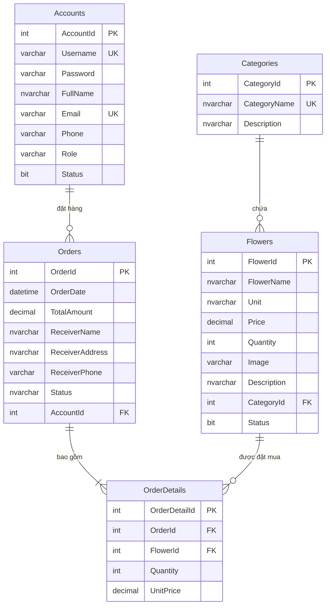

# Thiết Kế Cơ Sở Dữ Liệu — Flower Shop

## 2.1. Sơ đồ quan hệ thực thể (ERD)



## 2.2. Mô tả chi tiết từng bảng

### Bảng `Categories` — Danh mục hoa
| Cột          | Kiểu dữ liệu   | Ràng buộc       | Mô tả                        |
|--------------|------------------|------------------|-------------------------------|
| CategoryId   | INT IDENTITY     | PRIMARY KEY      | Mã danh mục (tự tăng)        |
| CategoryName | NVARCHAR(100)    | NOT NULL, UNIQUE | Tên danh mục (vd: Hoa cưới)  |
| Description  | NVARCHAR(255)    | NULL             | Mô tả ngắn về danh mục       |

### Bảng `Flowers` — Sản phẩm hoa
| Cột          | Kiểu dữ liệu   | Ràng buộc              | Mô tả                             |
|--------------|------------------|------------------------|------------------------------------|
| FlowerId     | INT IDENTITY     | PRIMARY KEY            | Mã hoa (tự tăng)                  |
| FlowerName   | NVARCHAR(150)    | NOT NULL               | Tên sản phẩm hoa                  |
| Unit         | NVARCHAR(50)     | DEFAULT N'Bông'        | Đơn vị tính (Bông, Đóa, Bó...)    |
| Price        | DECIMAL(18,2)    | NOT NULL, CHECK >= 0   | Giá bán (VNĐ)                     |
| Quantity     | INT              | NOT NULL, CHECK >= 0   | Số lượng tồn kho                  |
| Image        | VARCHAR(255)     | NULL                   | Đường dẫn file ảnh hoa            |
| Description  | NVARCHAR(MAX)    | NULL                   | Mô tả chi tiết sản phẩm           |
| CategoryId   | INT              | FK -> Categories       | Mã danh mục hoa thuộc về          |
| Status       | BIT              | DEFAULT 1              | 1 = Đang bán, 0 = Ngừng bán       |

### Bảng `Accounts` — Tài khoản người dùng
| Cột       | Kiểu dữ liệu   | Ràng buộc                              | Mô tả                              |
|-----------|------------------|----------------------------------------|-------------------------------------|
| AccountId | INT IDENTITY     | PRIMARY KEY                            | Mã tài khoản (tự tăng)             |
| Username  | VARCHAR(50)      | NOT NULL, UNIQUE                       | Tên đăng nhập                       |
| Password  | VARCHAR(256)     | NOT NULL                               | Mật khẩu đã băm SHA-256            |
| FullName  | NVARCHAR(100)    | NOT NULL                               | Họ tên đầy đủ                       |
| Email     | VARCHAR(100)     | NOT NULL, UNIQUE                       | Địa chỉ email                       |
| Phone     | VARCHAR(15)      | NOT NULL                               | Số điện thoại                       |
| Role      | VARCHAR(20)      | NOT NULL, CHECK IN (admin/employee/customer) | Vai trò phân quyền            |
| Status    | BIT              | DEFAULT 1                              | 1 = Hoạt động, 0 = Bị khóa         |

### Bảng `Orders` — Đơn đặt hàng
| Cột             | Kiểu dữ liệu   | Ràng buộc                                          | Mô tả                              |
|-----------------|------------------|----------------------------------------------------|-------------------------------------|
| OrderId         | INT IDENTITY     | PRIMARY KEY                                        | Mã đơn hàng (tự tăng)              |
| OrderDate       | DATETIME         | DEFAULT GETDATE()                                  | Ngày tạo đơn                        |
| TotalAmount     | DECIMAL(18,2)    | NOT NULL, CHECK >= 0                               | Tổng tiền đơn hàng                  |
| ReceiverName    | NVARCHAR(100)    | NOT NULL                                           | Tên người nhận                      |
| ReceiverAddress | NVARCHAR(255)    | NOT NULL                                           | Địa chỉ giao hàng                   |
| ReceiverPhone   | VARCHAR(15)      | NOT NULL                                           | SĐT người nhận                      |
| Status          | NVARCHAR(50)     | DEFAULT N'Chờ xử lý', CHECK IN (4 trạng thái)     | Trạng thái đơn hàng                 |
| AccountId       | INT              | FK -> Accounts, ON DELETE CASCADE                  | Mã khách hàng đặt đơn              |

### Bảng `OrderDetails` — Chi tiết đơn hàng
| Cột           | Kiểu dữ liệu   | Ràng buộc           | Mô tả                                          |
|---------------|------------------|---------------------|-------------------------------------------------|
| OrderDetailId | INT IDENTITY     | PRIMARY KEY         | Mã chi tiết (tự tăng)                          |
| OrderId       | INT              | FK -> Orders        | Đơn hàng thuộc về                               |
| FlowerId      | INT              | FK -> Flowers       | Sản phẩm hoa trong đơn                          |
| Quantity      | INT              | NOT NULL, CHECK > 0 | Số lượng hoa mua                                |
| UnitPrice     | DECIMAL(18,2)    | NOT NULL, CHECK >= 0| Giá bán tại thời điểm đặt (đóng băng giá)      |

## 2.3. Script SQL tạo Database

```sql
-- ============================================
-- TẠO DATABASE
-- ============================================
CREATE DATABASE FlowerShopDB;
GO
USE FlowerShopDB;
GO

-- ============================================
-- BẢNG 1: Categories (Danh mục hoa)
-- ============================================
CREATE TABLE Categories (
    CategoryId   INT IDENTITY(1,1) PRIMARY KEY,
    CategoryName NVARCHAR(100)  NOT NULL UNIQUE,
    Description  NVARCHAR(255)  NULL
);

-- ============================================
-- BẢNG 2: Flowers (Sản phẩm hoa)
-- ============================================
CREATE TABLE Flowers (
    FlowerId    INT IDENTITY(1,1) PRIMARY KEY,
    FlowerName  NVARCHAR(150)  NOT NULL,
    Unit        NVARCHAR(50)   DEFAULT N'Bông',
    Price       DECIMAL(18,2)  NOT NULL CHECK (Price >= 0),
    Quantity    INT            NOT NULL CHECK (Quantity >= 0),
    Image       VARCHAR(255)   NULL,
    Description NVARCHAR(MAX)  NULL,
    CategoryId  INT            NULL,
    Status      BIT            DEFAULT 1,
    CONSTRAINT FK_Flowers_Categories
        FOREIGN KEY (CategoryId) REFERENCES Categories(CategoryId)
        ON DELETE SET NULL
);

-- ============================================
-- BẢNG 3: Accounts (Tài khoản người dùng)
-- ============================================
CREATE TABLE Accounts (
    AccountId INT IDENTITY(1,1) PRIMARY KEY,
    Username  VARCHAR(50)    NOT NULL UNIQUE,
    Password  VARCHAR(256)   NOT NULL,
    FullName  NVARCHAR(100)  NOT NULL,
    Email     VARCHAR(100)   NOT NULL UNIQUE,
    Phone     VARCHAR(15)    NOT NULL,
    Role      VARCHAR(20)    NOT NULL
              CHECK (Role IN ('admin', 'employee', 'customer')),
    Status    BIT            DEFAULT 1
);

-- ============================================
-- BẢNG 4: Orders (Đơn đặt hàng)
-- ============================================
CREATE TABLE Orders (
    OrderId         INT IDENTITY(1,1) PRIMARY KEY,
    OrderDate       DATETIME       DEFAULT GETDATE(),
    TotalAmount     DECIMAL(18,2)  NOT NULL CHECK (TotalAmount >= 0),
    ReceiverName    NVARCHAR(100)  NOT NULL,
    ReceiverAddress NVARCHAR(255)  NOT NULL,
    ReceiverPhone   VARCHAR(15)    NOT NULL,
    Status          NVARCHAR(50)   DEFAULT N'Chờ xử lý'
                    CHECK (Status IN (N'Chờ xử lý', N'Đang giao', N'Đã giao', N'Đã hủy')),
    AccountId       INT            NOT NULL,
    CONSTRAINT FK_Orders_Accounts
        FOREIGN KEY (AccountId) REFERENCES Accounts(AccountId)
        ON DELETE CASCADE
);

-- ============================================
-- BẢNG 5: OrderDetails (Chi tiết đơn hàng)
-- ============================================
CREATE TABLE OrderDetails (
    OrderDetailId INT IDENTITY(1,1) PRIMARY KEY,
    OrderId       INT            NOT NULL,
    FlowerId      INT            NOT NULL,
    Quantity      INT            NOT NULL CHECK (Quantity > 0),
    UnitPrice     DECIMAL(18,2)  NOT NULL CHECK (UnitPrice >= 0),
    CONSTRAINT FK_OrderDetails_Orders
        FOREIGN KEY (OrderId) REFERENCES Orders(OrderId)
        ON DELETE CASCADE,
    CONSTRAINT FK_OrderDetails_Flowers
        FOREIGN KEY (FlowerId) REFERENCES Flowers(FlowerId)
);
GO
```

## 2.4. Dữ liệu mẫu (Sample Data)

```sql
-- ============================================
-- DỮ LIỆU MẪU
-- ============================================

-- Danh mục hoa
INSERT INTO Categories (CategoryName, Description) VALUES
(N'Hoa cưới',       N'Hoa trang trí và hoa cầm tay dành cho lễ cưới'),
(N'Hoa sinh nhật',  N'Bó hoa và giỏ hoa chúc mừng sinh nhật'),
(N'Hoa khai trương', N'Hoa chúc mừng khai trương, khánh thành'),
(N'Hoa chia buồn',  N'Vòng hoa, lẵng hoa chia buồn, tang lễ'),
(N'Hoa trang trí',  N'Hoa cắm bàn, hoa trang trí nội thất');

-- Sản phẩm hoa
INSERT INTO Flowers (FlowerName, Price, Quantity, Image, Description, CategoryId) VALUES
(N'Bó hồng đỏ 20 bông',     350000,  50, 'rose_red.jpg',     N'Bó hoa hồng đỏ 20 bông kèm baby trắng',   2),
(N'Giỏ hoa hướng dương',     280000,  35, 'sunflower.jpg',    N'Giỏ hoa hướng dương tươi sáng',             2),
(N'Bó hoa cưới cầm tay',     500000,  20, 'bridal.jpg',       N'Bó hoa cưới cầm tay phong cách châu Âu',   1),
(N'Lẵng hoa khai trương',    800000,  15, 'grand_open.jpg',   N'Lẵng hoa khai trương 2 tầng',               3),
(N'Bó hoa ly trắng',         420000,  30, 'white_lily.jpg',   N'Bó hoa ly trắng thanh lịch 10 cành',        5),
(N'Hoa cúc vàng chia buồn',  200000,  40, 'chrysanthemum.jpg', N'Vòng hoa cúc vàng chia buồn',              4),
(N'Bó hoa tulip hỗn hợp',    600000,  25, 'tulip_mix.jpg',    N'Bó tulip hỗn hợp nhập khẩu Hà Lan',        5),
(N'Hoa cưới pastel',         650000,  18, 'pastel_bridal.jpg', N'Bó hoa cưới tông màu pastel nhẹ nhàng',    1),
(N'Giỏ hoa chúc mừng',       350000,  28, 'congrats.jpg',     N'Giỏ hoa hỗn hợp chúc mừng',                3),
(N'Bó hoa lan hồ điệp',      750000,  12, 'orchid.jpg',       N'Bó lan hồ điệp nhập khẩu cao cấp',         5);

-- Tài khoản (mật khẩu mẫu: "123456" đã băm SHA-256)
INSERT INTO Accounts (Username, Password, FullName, Email, Phone, Role) VALUES
('admin',    '8d969eef6ecad3c29a3a629280e686cf0c3f5d5a86aff3ca12020c923adc6c92',
    N'Nguyễn Quản Trị',   'admin@flowershop.vn',    '0901000001', 'admin'),
('staff1',   '8d969eef6ecad3c29a3a629280e686cf0c3f5d5a86aff3ca12020c923adc6c92',
    N'Trần Nhân Viên',    'nv1@flowershop.vn',      '0901000002', 'employee'),
('customer1','8d969eef6ecad3c29a3a629280e686cf0c3f5d5a86aff3ca12020c923adc6c92',
    N'Lê Khách Hàng',     'kh1@gmail.com',          '0901000003', 'customer'),
('customer2','8d969eef6ecad3c29a3a629280e686cf0c3f5d5a86aff3ca12020c923adc6c92',
    N'Phạm Minh Anh',     'minhanh@gmail.com',      '0901000004', 'customer');

-- Đơn hàng mẫu
INSERT INTO Orders (TotalAmount, ReceiverName, ReceiverAddress, ReceiverPhone, Status, AccountId) VALUES
(700000,  N'Nguyễn Văn A', N'123 Nguyễn Huệ, Q.1, TP.HCM',   '0909111222', N'Đã giao', 3),
(800000,  N'Trần Thị B',   N'456 Lê Lợi, Q.3, TP.HCM',       '0909333444', N'Đang giao', 3),
(350000,  N'Phạm Văn C',   N'789 Hai Bà Trưng, Q.1, TP.HCM',  '0909555666', N'Chờ xử lý', 4);

-- Chi tiết đơn hàng
INSERT INTO OrderDetails (OrderId, FlowerId, Quantity, UnitPrice) VALUES
(1, 1, 2, 350000),    -- Đơn 1: 2 bó hồng đỏ
(2, 4, 1, 800000),    -- Đơn 2: 1 lẵng hoa khai trương
(3, 2, 1, 280000),    -- Đơn 3: 1 giỏ hoa hướng dương
(3, 6, 1, 200000);    -- Đơn 3: thêm 1 hoa cúc chia buồn (nhưng tổng = 350000 vì giả lập giảm giá, hoặc chỉnh TotalAmount)
GO
```

## 2.5. Giải thích chuẩn hóa 3NF

- **1NF:** Mọi thuộc tính đều đơn trị. Không có trường nào lưu nhiều giá trị
  trong cùng một ô (ví dụ không nhét danh sách hoa vào một cột của bảng Orders).
- **2NF:** Tất cả các thuộc tính không khóa phụ thuộc hoàn toàn vào khóa chính.
  Bảng `OrderDetails` tách riêng khỏi bảng `Orders` để tránh phụ thuộc bộ phận.
- **3NF:** Không tồn tại phụ thuộc bắc cầu. Trường `UnitPrice` trong `OrderDetails`
  lưu giá tại thời điểm mua để tránh phụ thuộc bắc cầu vào giá hiện tại của
  bảng `Flowers` (vì giá hoa có thể thay đổi theo thời gian).
