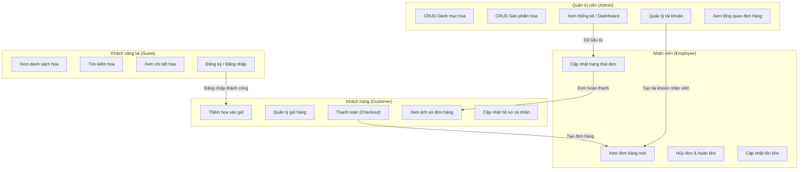
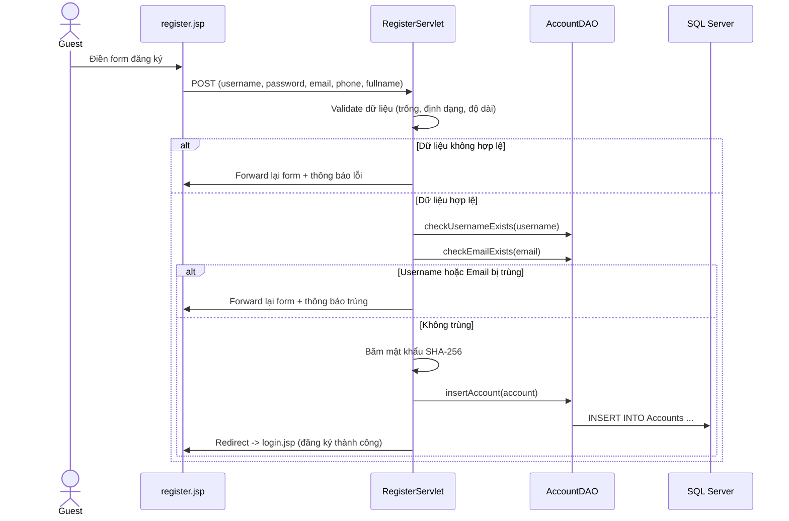
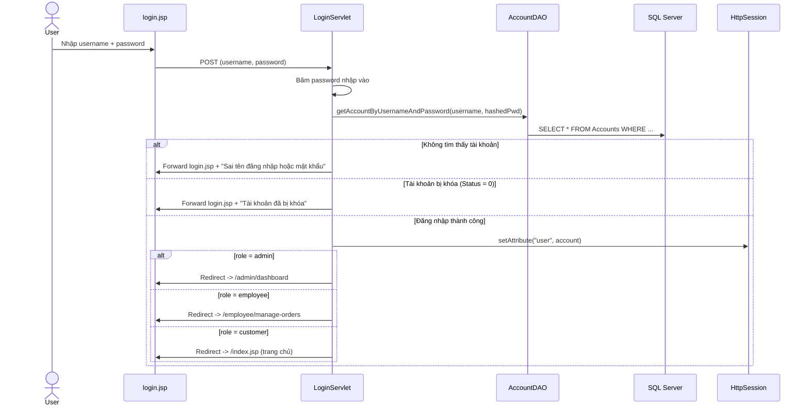
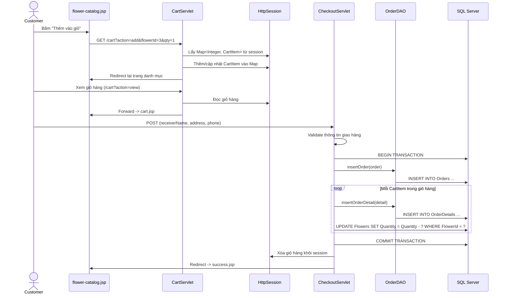
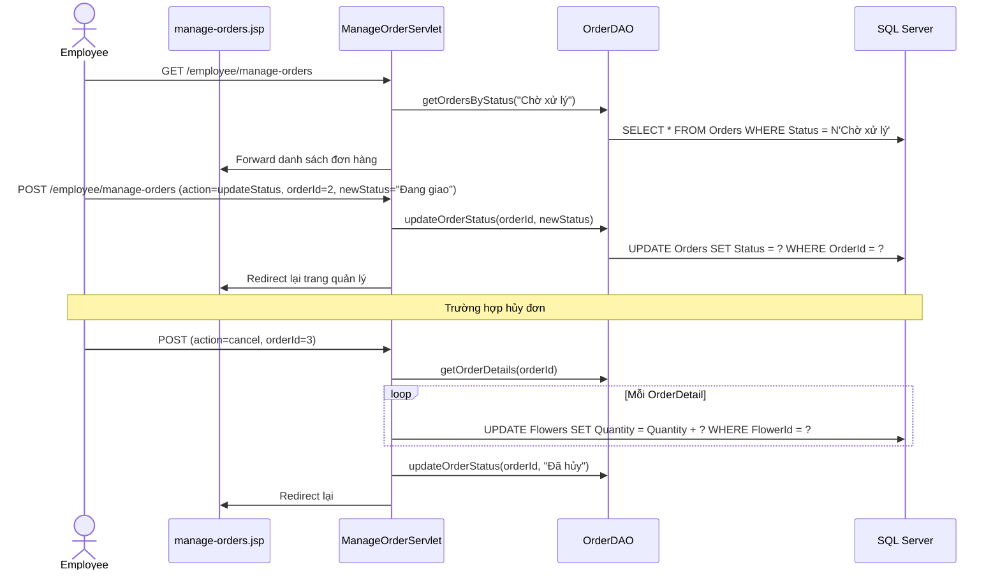
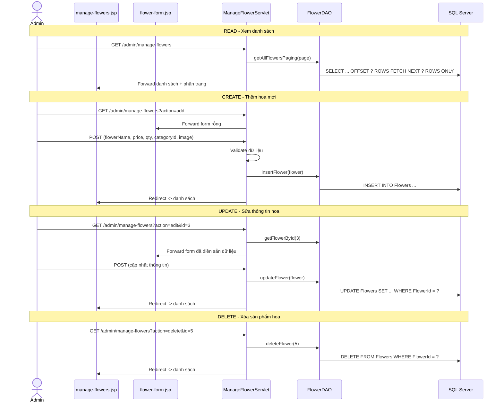

# Luồng Xử Lý Nghiệp Vụ & Phân Quyền — Flower Shop

## 3.1. Sơ đồ tương tác giữa các vai trò



## 3.2. Ma trận phân quyền (Permission Matrix)

Bảng dưới đây liệt kê rõ ràng từng chức năng mà mỗi vai trò có quyền truy cập.
Đây là cơ sở để cấu hình `AuthorizationFilter` trong tệp `web.xml`.

| Chức năng / Trang              | Guest | Customer | Employee | Admin |
|---------------------------------|:-----:|:--------:|:--------:|:-----:|
| Xem trang chủ, danh sách hoa   |  ✅   |    ✅    |    ✅    |  ✅   |
| Tìm kiếm sản phẩm hoa          |  ✅   |    ✅    |    ✅    |  ✅   |
| Xem chi tiết sản phẩm hoa      |  ✅   |    ✅    |    ✅    |  ✅   |
| Đăng ký tài khoản               |  ✅   |    ❌    |    ❌    |  ❌   |
| Đăng nhập                       |  ✅   |    ❌    |    ❌    |  ❌   |
| Thêm hoa vào giỏ hàng          |  ❌   |    ✅    |    ❌    |  ❌   |
| Xem / sửa giỏ hàng             |  ❌   |    ✅    |    ❌    |  ❌   |
| Thanh toán đặt đơn             |  ❌   |    ✅    |    ❌    |  ❌   |
| Xem lịch sử đơn hàng cá nhân  |  ❌   |    ✅    |    ❌    |  ❌   |
| Cập nhật hồ sơ cá nhân         |  ❌   |    ✅    |    ✅    |  ✅   |
| Xem danh sách đơn cần xử lý   |  ❌   |    ❌    |    ✅    |  ✅   |
| Cập nhật trạng thái đơn hàng   |  ❌   |    ❌    |    ✅    |  ✅   |
| Hủy đơn hàng & hoàn trả kho   |  ❌   |    ❌    |    ✅    |  ✅   |
| Cập nhật số lượng tồn kho      |  ❌   |    ❌    |    ✅    |  ✅   |
| CRUD Danh mục hoa              |  ❌   |    ❌    |    ❌    |  ✅   |
| CRUD Sản phẩm hoa              |  ❌   |    ❌    |    ❌    |  ✅   |
| Quản lý tài khoản người dùng   |  ❌   |    ❌    |    ❌    |  ✅   |
| Xem Dashboard thống kê         |  ❌   |    ❌    |    ❌    |  ✅   |

### Cấu hình URL Pattern cho Filter

```
/admin/*        → Chỉ role = "admin"
/employee/*     → Chỉ role = "employee" hoặc "admin"
/customer/*     → Chỉ role = "customer" (đã đăng nhập)
/cart, /checkout → Chỉ role = "customer" (đã đăng nhập)
/*              → Tất cả (public)
```

## 3.3. Luồng nghiệp vụ chi tiết

### Luồng 1: Đăng ký tài khoản



### Luồng 2: Đăng nhập & Phân quyền



### Luồng 3: Mua hàng (Giỏ hàng → Thanh toán)



### Luồng 4: Nhân viên xử lý đơn hàng



### Luồng 5: Admin quản lý sản phẩm hoa (CRUD)


