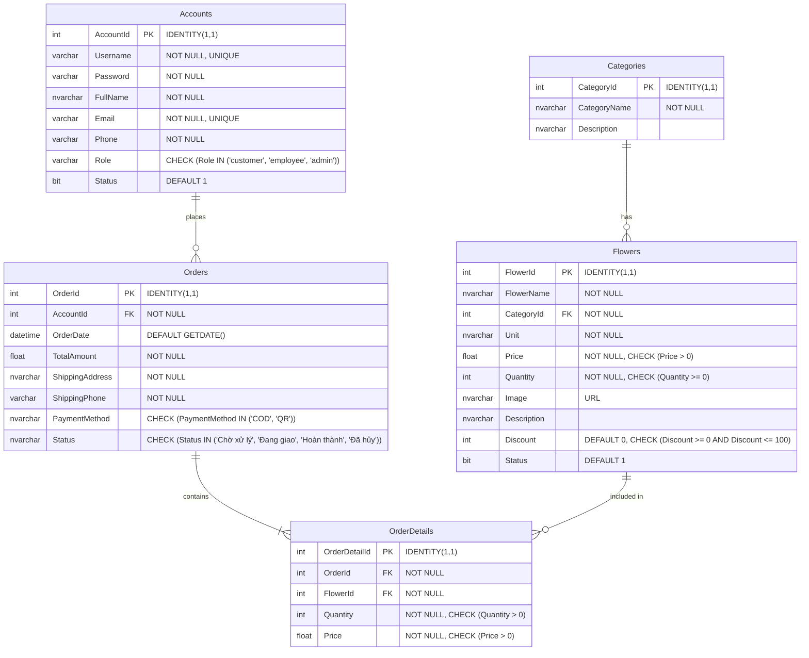

# Database Entity-Relationship Diagram (ERD)

This document visualizes the database schema for the Flower Shop project.

## Description
- **Categories**: Stores flower categories.
- **Flowers**: Stores flower products, linked to Categories.
- **Accounts**: Stores user accounts including customers, employees, and admins.
- **Orders**: Stores order information placed by Accounts.
- **OrderDetails**: Stores line items for each Order, linking Orders to Flowers.
